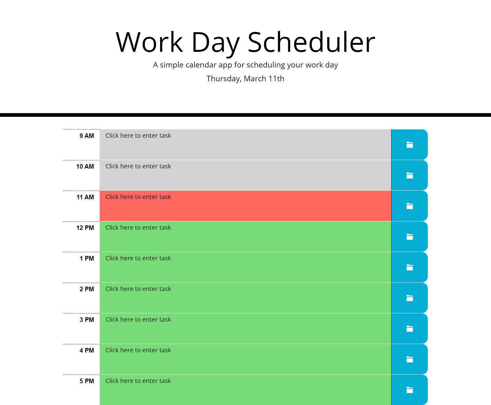

# Work Day Scheduler

Work Day Scheduler is a webpage created using third party API's like Bootstrap and JQuery. The webpage can be use to track day to day schedule. Tasks can be edit it just by clicking in the text. Any particular task can be save by clicking in the right button. saved task are store in LocalStorage and keep until user clears local storage.

## Website Screenshot

## Link to Website
[Work Day Scheduler](https://hbbc248.github.io/work-day-scheduler/)
